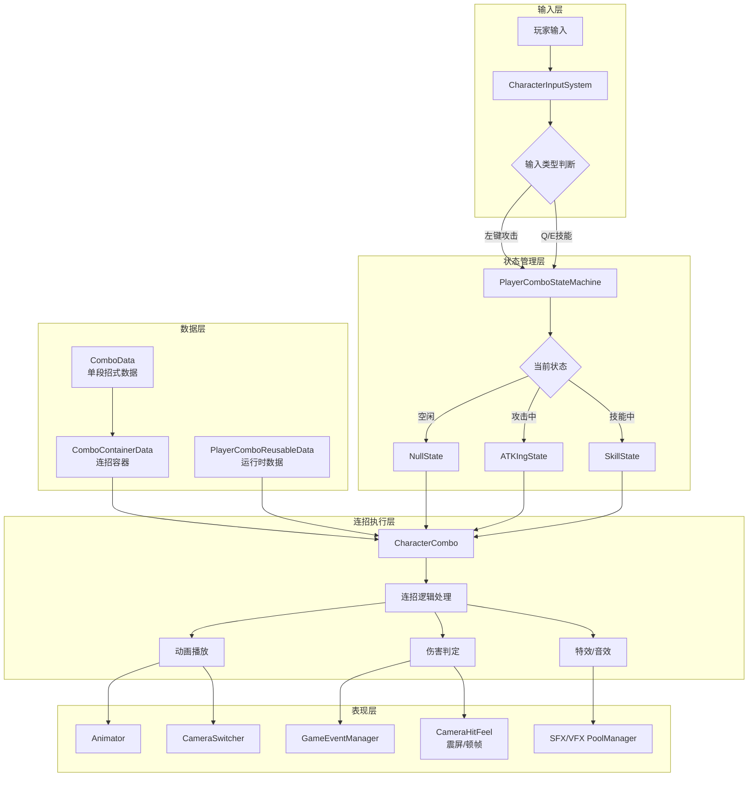
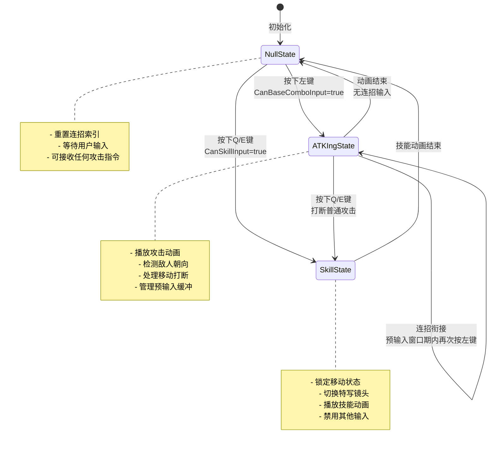
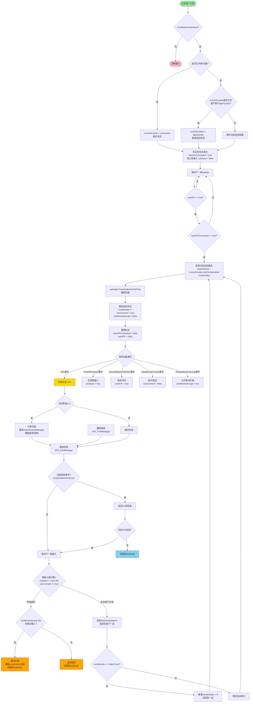
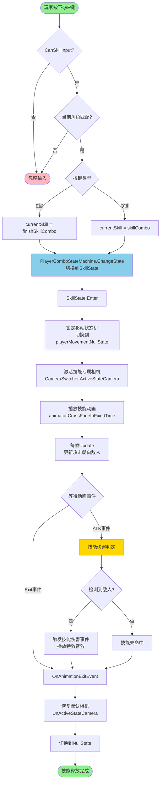
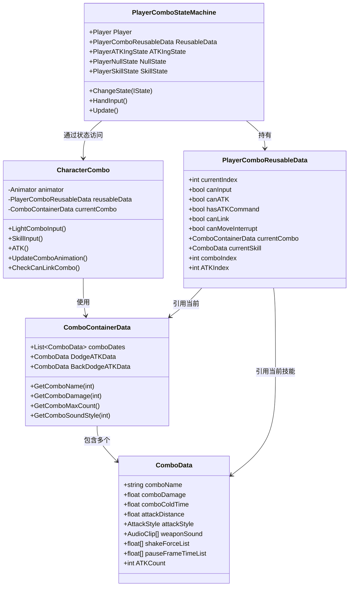
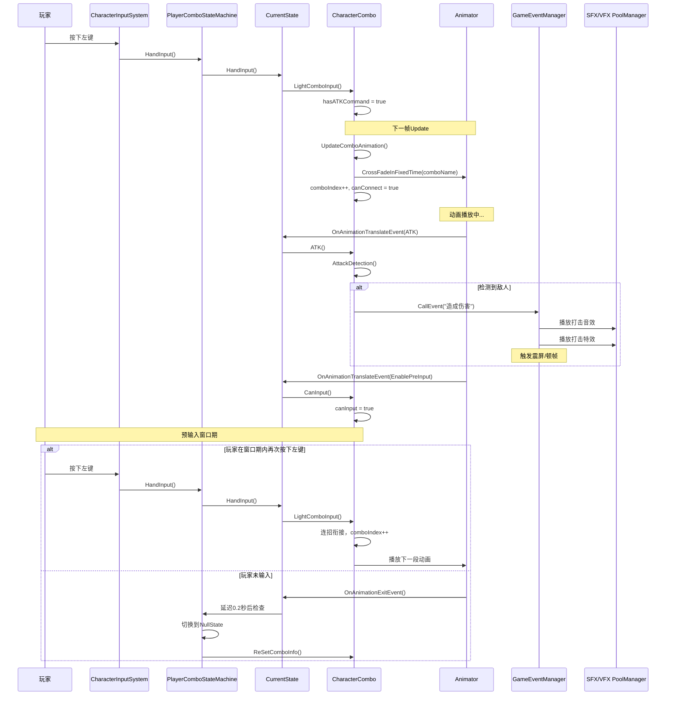
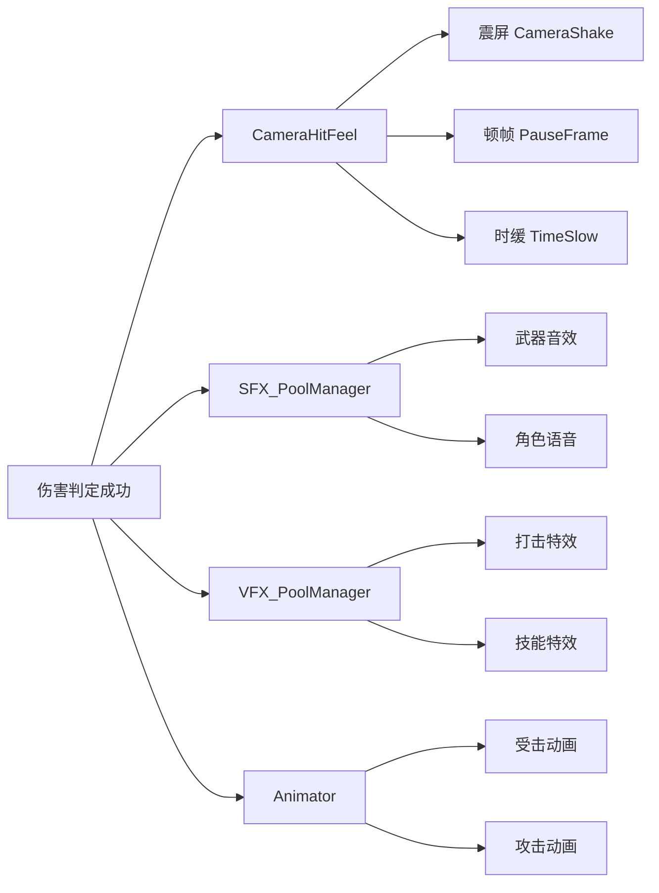

### 流程图
┌──────────────┐     按下攻击键      ┌─────────────────┐
│              │ ──────────────────? │                 │
│  NullState   │                     │  ATKIngState    │
│  (空闲状态)   │ ?────────────────── │  (攻击中状态)    │
│              │   动画结束+无连招    │                 │
└──────┬───────┘                     └─────────────────┘
       │                                    ▲
       │ 按下Q/E键                          │ 连招衔接
       ��                                    │
┌──────────────┐                           │
│              │ ──────────────────────────┘
│ SkillState   │   技能动画结束
│  (技能状态)   │
│              │
└──────────────┘

### 设计亮点
? 状态预实例化：避免运行时 GC 压力
? 数据分离：静态配置（ScriptableObject）与动态数据（ReusableData）解耦
? 事件驱动：输入系统与状态机通过事件解耦
? 可扩展性：新增状态只需继承 PlayerComboState 并注册到状态机
? 相机集成：技能状态自动管理镜头切换，提升战斗表现力


## ? ZZZDemo 连招系统详细流程图

### ? **一、系统整体架构**



---

### ? **二、核心状态流转图**



---

### ?? **三、普通攻击连招流程（核心）**



---

### ? **四、技能释放流程**



---

### ? **五、数据结构关系图**



---

### ? **六、动画事件时序图**



---

### ? **七、关键机制说明**

#### **1. 预输入缓冲机制（Pre-Input Buffer）**
```
时间轴：|--攻击动画--|--预输入窗口--|--空闲--|
                    ↑              ↑
                 可以输入       超时则断连
```
- **实现方式**：通过 [canInput](file://e:\lzy\_Tools\unity_dev\zzzdemo\Assets\Scripts\FSM\Characters\Player\Data\States\PlayerComboReusableData.cs#L20-L20) 和 [canConnect](file://e:\lzy\_Tools\unity_dev\zzzdemo\Assets\Scripts\Combo\CharacterComboBase.cs#L36-L36) 两个标志控制
- **触发动画事件**：[EnablePreInput](file://e:\lzy\_Tools\unity_dev\zzzdemo\Assets\Scripts\FSM\Characters\Player\State%20Machine\Combo\States\ComboStates\PlayerATKIngState.cs#L25-L28) 开启输入，[DisableLinkCombo](file://e:\lzy\_Tools\unity_dev\zzzdemo\Assets\Scripts\FSM\Characters\Player\State%20Machine\Combo\States\ComboStates\PlayerATKIngState.cs#L33-L36) 关闭连招
- **目的**：让玩家在动画结束前按下攻击键也能流畅衔接，提升操作手感

#### **2. 移动打断机制（Move Interrupt）**
```
攻击动画播放 → EnableMoveInterrupt事件 → canMoveInterrupt = true
                                        ↓
                                  检测到移动输入
                                        ↓
                                  中断攻击动画
                                        ↓
                                  切换到移动状态
```
- **应用场景**：某些轻量攻击可通过移动取消后摇
- **控制变量**：[canMoveInterrupt](file://e:\lzy\_Tools\unity_dev\zzzdemo\Assets\Scripts\FSM\Characters\Player\Data\States\PlayerComboReusableData.cs#L28-L28)

#### **3. 连招断开机制（Combo Break）**
```
触发条件：
1. DisableLinkCombo 动画事件触发
2. 预输入窗口期超时
3. 玩家按下奔跑键
4. 移动打断触发
```

#### **4. 伤害判定机制**
```
ATK动画事件触发
    ↓
检测敌人（SphereCast射线检测）
    ↓
距离判断 + 角度判断
    ↓
触发GameEventManager事件
    ↓
通知Health系统扣血
    ↓
播放打击反馈（音效/特效/震屏/顿帧）
```

---

### ? **八、视觉反馈流程**



---

### ? **九、完整连招示例流程**

以「三段普通攻击」为例：

```
时间线     玩家操作          系统状态               动画事件
─────────────────────────────────────────────────────────────
T0        按下左键         NullState→ATKIngState  
                            设置currentCombo       
                            comboIndex=0           
                            
T0+1帧                     播放第1段攻击动画      
                            
T0+0.3s                    ATK事件触发            
                            伤害判定 → 播放音效    
                            
T0+0.5s                    EnablePreInput         
                            canInput=true          
                            
T0+0.6s   按下左键         检测到预输入           
                            comboIndex=1           
                            播放第2段攻击动画      
                            
T0+0.9s                    ATK事件触发            
                            第2段伤害判定          
                            
T0+1.0s                    EnablePreInput         
                            
T0+1.1s   按下左键         检测到预输入           
                            comboIndex=2           
                            播放第3段攻击动画      
                            
T0+1.5s                    DisableLinkCombo       
                            canConnect=false       
                            
T0+1.8s                    OnAnimationExitEvent   
                            延迟0.2秒检查          
                            
T0+2.0s                    切换到NullState        
                            ReSetComboInfo()       
                            comboIndex重置为0      
```

---

这份流程图涵盖了从**输入检测** → **状态管理** → **连招执行** → **伤害判定** → **视听反馈**的完整链路。如果你想深入了解某个具体环节（比如对象池的实现、伤害计算细节、或者如何扩展新的连招类型），我可以继续为你详细解析！